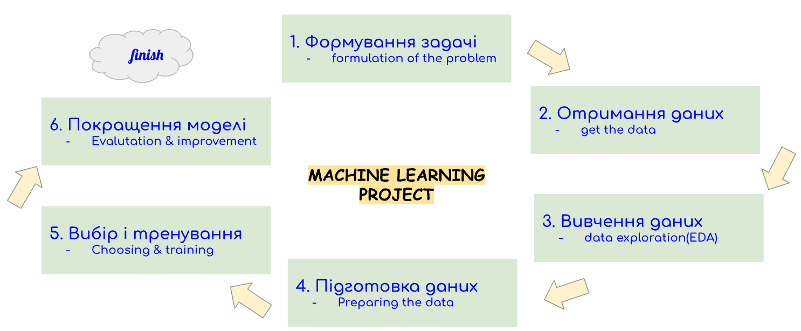
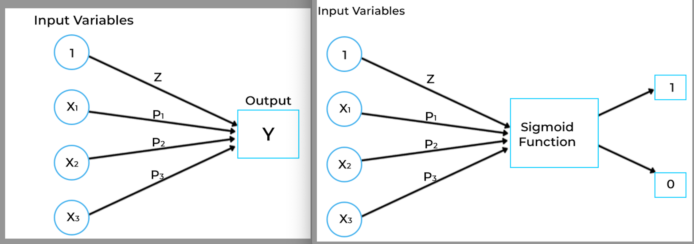

# Titanic - Machine Learning from Disaster
 - source: https://www.kaggle.com/competitions/titanic/overview

 
## **The procedure for developing a machine learning project**

> 

1. formation of the problem [формування задачі]
2. receiving data [отримання даних]
3. EDA [вивчення даних]
4. data preparation [підготовка даних]
5. model selection and training [вибір і тренування моделі]
6. model improvements [покращення моделі]

CONTENT:
1. Analyze the dataset and train the model.
2. Download the Titanic dataset, namely train.csv and test.csv.
3. EDA_Study the data. Make a visualization that you think is necessary. Construct a correlation matrix.
4. Perform a data cleanup as needed. Identify the set of traits that you think most influence human survival.
5. Train a linear regression on train.csv on these features. For classification using linear regression
   - 5.1 Analyze the output of the model, namely, calculate the metrics of the classification task for test.csv. 
   - 5.2 Compare with metrics for train.csv

**The following metrics are of interest:**
- Accuracy
- Precision
- Recall
- F1 Score
- ROC
- AUC
- Confusion Matrix 
6. Improve your performance by training logistic regression.

  
> 

